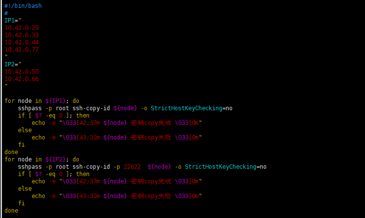

## Ansible 介绍

Ansible是一个远程主机批量管理工具。
- 通过 `ssh` 协议实现与远程节点的通信
- 调用插件模块完成各种自动化操作
  - 复制文件
  - 安装包
  - 发起服务

解决了批量自动化实现系统配置、应用部署、命令和服务操作的问题。其脚本具有灵活性、可重入的特性，极大的减少了运维人员的重复劳动，提高了运维效率。

## Ansible 安装

#### 1. 安装软件
```
~]# yum install ansible
```

#### 2. 配置 Ansible 管理节点和主机的连接
```
~]# ssh-keygen  -t rsa
~]# ssh-copy-id  10.42.0.61
~]# ssh-copy-id  -p 22622 10.42.0.71
```
脚本批量快速复制:`yum install sshpass`


#### 3. 主机清单`Host Inventory`
用来告诉 ansible 需要管理哪些主机，并且把这些主机按需分类。例如根据用途分类为数据库节点，服务节点等，也可以根据地点分类为中部机房，西部机房等。

 默认的文件： `/etc/ansible/hosts`
```
[webservers]
10.42.0.61
10.42.0.71:22622
ansible ansible_ssh_host=10.42.0.20

[dbservers]
10.42.0.62 ansible_ssh_port=22622  ansible_ssh_pass=centos6
10.42.0.72:22622
```
 


## 配置参数优化-`ansible.cfg`
```
mainfests]# grep -v ^# /etc/ansible/ansible.cfg |grep -v "^$"
[defaults]
gathering = smart
roles_path    = /etc/ansible/roles
host_key_checking = False
display_skipped_hosts = False
[inventory]
[privilege_escalation]
[paramiko_connection]
[ssh_connection]
ssh_args = -C -o ControlMaster=auto -o ControlPersist=3600s
control_path = %(directory)s/%%h-%%r
pipelining = True
sftp_batch_mode = True
[persistent_connection]
[accelerate]
[selinux]
[colors]
[diff]
```
