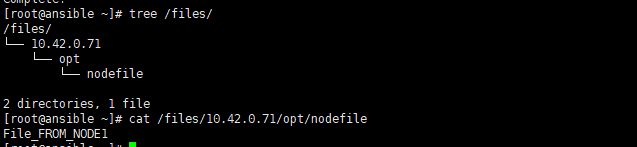

`Ad-Hoc` 是指ansible下临时执行的一条命令，并且不需要报错的命令，执行格式如下：
```
ansible <host-pattern> [-i path] [-f forks] [-m module_name] [-a args]
```
- 列出ansible支持的所有模块：`~]# ansible-doc -l`
- 查询某个模块的帮助文件：`~]# ansible-doc -s ping`

## ping 模块主机连通信探测

## command模块：在远程主机运行命令（模块可省），不支持管道，重定向等操作
```
~]# ansible all -a  "ls /root"
~]# ansible all -m command -a "ls /root"
```

## shell模块：使用shell命令行执行，支持管道，变量，从定向等操作
```
~]# ansible all -m shell -a "useradd test"
~]# ansible all -m shell  -a "echo "test"|passwd --stdin test"
```

## copy 模块：Copies files to remote locations
```
~]# touch ansiblefile
~]# ansible all -m copy -a "src=/root/ansiblefile dest=/test/"
~]# ansible all -m copy -a "src=/root/ansiblefile dest=/test/file"  #修改文件名为file
~]# ansible all -m copy -a "content='hello world\n' dest=/test/file"
~]# ansible all -m copy -a "content='hello world\n' owner=test group=test  mode=0666 dest=/test/test2"
```


## cron 模块：Manage cron.d and crontab entries. 管理计划任务
```
~]# ansible all -m cron -a "minute=*/5 job='/usr/sbin/ntpdate 0.centos.pool.ntp.org &> /dev/null' name=SyncTime"
~]# ansible all -m cron -a "state=absent name=SyncTime"
```

## fetch模块：Fetches a file from remote nodes ，从远程主机上拉取文件到本地
- 会递归拉去远程文件到本地：并命名为：`/DEST/IP/DIR/DIR/file`

```
~]# ansible 10.42.0.71 -m fetch -a "src=/opt/nodefile dest=/files"  # dest为目录，会自动创建
```



## file模块：Sets attributes of files ，设定文件的属性
```
~]# ansible all -m file -a "src=/tmp/test path=/root/test.link state=link"  # src必须存在
~]# ansible all -m file -a "path=/root/testdir mode=766 state=directory"
```
- 创建链接文件：`*path= src= state=link`
- 修改属性：`path= owner= mode= group=`
- 创建目录：`path= state=directory`

## hostname模块：Manage hostname：可以使用循环的方式引用变量对主机名进行修改
```
~]# for i in 61 62 ;do ansible 10.42.0.$i -m hostname -a "name=centos$i";done
```

## yum模块：Manages packages with the `yum’ package manager
```
~]# ansible all -m yum -a "name=tree state=latest"
~]# ansible all -m yum -a "name=tree state=absent"
```

## service模块：管理服务
```
~]# ansible all -m service -a "name=httpd state=started"
~]# ansible all -m service -a "name=httpd state=stopped"
```

## user模块：管理用户账号
```
~]# ansible all -m user -a "name=sysuser system=yes uid=308 state=present"
```

## group模块：添加或删除组

## script模块：本地管理机器的脚本在远程执行
```
~]# ansible all -m script -a "/scripts/test.sh"  # 此为被管理机上的脚本
```

## setup模块：获取远程主机的facts变量
```
~]# ansible 10.42.0.61 -m setup
```

## template模块：基于模板方式生成一个文件，而后复制到远程主机
```
src]# ansible dbservers -m template -a  "src=./my.cnf.template dest=/opt/my.cnf"
```
