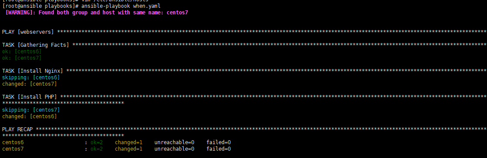

与其他配置管理解决方案一样，Ansible 使用一个比喻来描述配置文件，他们被称为“剧本”( `Playbooks` ),它用于编排一组任务到特定的主机或者主机组中执行。剧本使用 `Yaml` 语言编写，这是一种简单易读得语法，常用于定义配置。

> 吸引大多数DevOps人员进行Ansible的原因是很容易转换shell脚本（或
一次完成的shell命令）直接进入可解释的播放。考虑下面的脚本，它安装
RHEL/CentOS服务器上的Apache：

```
1 # Install Apache.
  yum install --quiet -y httpd httpd-devel
2 # Copy configuration files.
  cp /path/to/config/httpd.conf /etc/httpd/conf/httpd.conf
  cp /path/to/config/httpd-vhosts.conf /etc/httpd/conf/httpd-vhosts.conf
3 # Start Apache and configure it to run at boot.
  service httpd start
  chkconfig httpd on
```

**Ansible Playbook**
> 很多情况下，我们都是将上面得步骤组织成`shell scripts`来执行,但是有了 `Playbook` ，我们可以通过编写 `yaml` 文件实现上面得脚本


**执行剧本**
- 语法检查：`ansible-playbook --check 01_install_httpd.yaml`
- 执行剧本：`ansible-playbook  01_install_httpd.yaml`
- 列出运行任务的主机：`ansible-playbook 01_install_httpd.yaml --list-hosts`
- 限制ansible主机执行此剧本 ：`ansible-playbook 01_install_httpd.yaml --limit ansible`
- 使用janedoe用户使用sudo执行：`ansible-playbook 01_install_httpd.yaml --sudo  --sudo-user=janedoe --ask-sudo-pass`


**改良 Ansible Playbook**


## 触发器-handlers

任务在特定条件下触发；只有监控的资源发生变化时才会被触发；例如：当我们修改配置文件，就可以通过定义触发器来实现服务重启；或者接收到其他任务的通知被触发。

> 当配置文件发生变化时，我们通过notify来通知handlers进行服务器重启,例如：
```
---
- hosts: centos7
  remote_user: root
  tasks:
  - name: Install Apache Server
    yum: name=httpd state=present
  - name: Copy configure For Apache
    copy: src=conf/httpd.conf.explam dest=/etc/httpd/conf/httpd.conf
    notify: Restart Apache Service
  - name: Start Apache Service
    service: name=httpd state=started
  handlers:
  - name: Restart Apache Service
    service: name=httpd state=restarted
```


## 标签-tags

```
---
- hosts: centos7
  remote_user: root
  tasks:
  - name: Install Httpd Server
    yum: name=httpd state=present
    tags: ins_httpd
  - name: Copy Httpd Configure
    copy: src=./conf/httpd.conf.explam dest=/etc/httpd/conf/httpd.conf
    tags: ins_conf
    notify: Restart Httpd Server
  - name: Start Httpd Server
    service: name=httpd state=started
    tags: start_httpd
  handlers:
  - name: Restart Httpd Server
    service: name=httpd state=restarted
    tags: restart_httpd
```

## 变量-Variables
- 1.**facts**：通过setup模块获取变量名，要想在配置文件中进行调用，必须使用`template`模块

```
playbooks]# ansible centos7 -m setup|grep hostname
        "ansible_hostname": "node1",
        "ansible_hostname": "node2",
```

- 2.命令行中定义变量，通过 `-e VARS` 或 `--extra-vars=VARS` 来调用

```
playbooks]# cat variables.yaml
---
- hosts: centos7
  remote_user: root
  tasks:
  - name: install {{ PKG_NAME }}
    yum: name={{ PKG_NAME }} state=present
```


- 4.通过 **Host Inventory** 传递变量

```
# 向不同的主机传递不同的变量
[websrvs]
10.42.0.71:22622  HNAME=www.node1.com
10.42.0.72:22622  HNAME=www.node2.com
```
```
playbooks]# cat honame_vars.yaml
---
- hosts: websrvs
  remote_user: root
  tasks:
  - name: Set Hostname
    hostname: name={{ HNAME }}
```


## **配置文件中调用变量**，必须使用`template模块`才能使变量引用生效，而非使用copy模块
```
---
- hosts: websrvs
  remote_user: root
  vars:
  - http_port: 8888
  - server_name: www.node.com

  tasks:
  - name: Install Httpd Server
    yum: name=httpd state=present
  - name: Install Configure
    template: src=./conf/httpd.conf.explam dest=/etc/httpd/conf/httpd.conf
    notify: Restart_Httpd
  - name: Start Httpd
    service: name=httpd state=started
  handlers:
  - name: Restart_Httpd
    service: name=httpd state=restarted
```
配置文件模板：`conf/httpd.conf.explam`


- 更新httpd配置文件：`ansible-playbook -t ins_conf tags.yaml `


## 条件测试-when语句

如果需要根据变量、facts或此前任务的执行结果来做为某task执行与否的前提时要用到条件测试。简而言之，当条件满足时执行某一命令，不满足时执行其他命令。

> 我们通过判断系统的版本，安装不同的服务
```
---
- hosts: webservers
  remote_user: root
  tasks:
  - name: Install Nginx
    yum: name=nginx state=present
    when: ansible_distribution_major_version == "7"
    tags: ins_nginx
  - name: Install PHP
    yum: name=php state=present
    when: ansible_distribution_major_version == "6"
```


## 循环迭代-Item
当有需要重复性执行的任务时，可以使用迭代机制。

> 其使用格式为将需要迭代的内容定义为item变量引用，并通过with_items语句来指明迭代的元素列表即可。例如:
```
playbooks]# cat item.yaml
---
- hosts: websrvs
  remote_user: root
  vars:
    item_pkg:
    - nginx
    - php
    - memcached
  tasks:
  - name: Install PKG
    yum: name={{ item_pkg }} state=present
    with_items: "{{ item_pkg }}"
```
